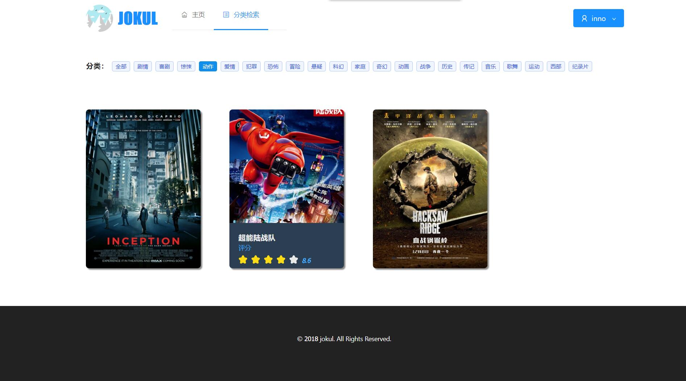
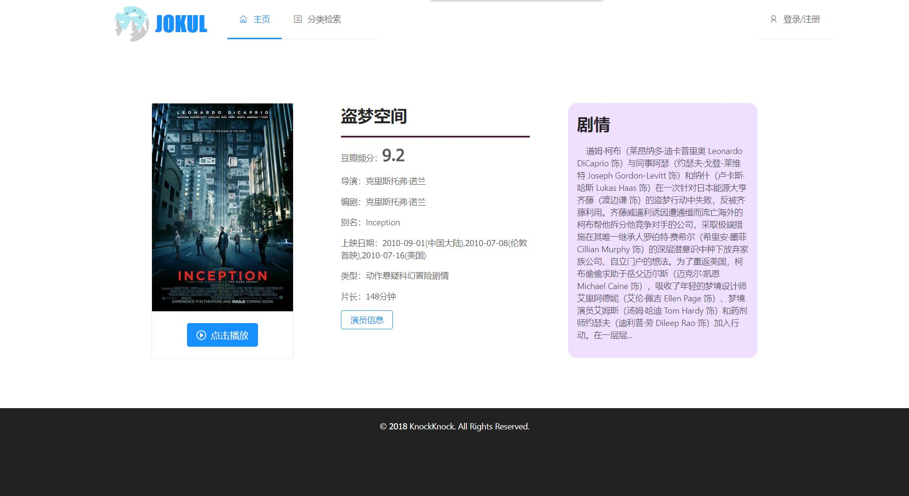

<div align="center">


**A movie site built by spring boot and react.js**

     

</div>

<br />

## How to run

**Firstly, clone it**

```
> $ git clone git@github.com:InnoFang/jokul.git
> $ cd jokul
```

**Secondly, deploy server**

Use maven

```
> $ mvn spring-boot:run
```

After a while, you can access the server data.

**PS** For the first run, the server data is empty. You have to add data by yourself. Reference the [Server data interface](./server_data_interface.md)

**Last but not least, run the client**

```
> $ cd client
```

You can use npm

```
> $ npm start
```

or you can use yarn


```
> $ yarn start
```


## Server data interface

 + Get movie list ***GET*** `http://localhost:8080/jokul/movie-list/{page}`
 + Get movie detail ***GET*** `http://localhost:8080/jokul/{title}`
 + Upload movie file ***POST*** `http://localhost:8080/jokul/play/{movie}`
 + Get all the movie types ***GET*** `http://localhost:8080/jokul/types`
 + Get a list of movies by type ***GET*** `http://localhost:8080/jokul/{type}/{page}`
 + Get resource links for all the uploaded movies ***GET*** `http://localhost:8080/jokul/movie-src-list`

 [Detail](./server_data_interface.md)

<br />

## User interface

<div align="center">

> Home Page


<br />
<br />


> Category Page



<br />
<br />

> Movie Detail Page



<br />
<br />


> Play a Movie


<br />
<br />

</div>

## [License](https://github.com/InnoFang/jokul/blob/master/LICENSE)


           Copyright 2018 InnoFang

           Licensed under the Apache License, Version 2.0 (the "License");
           you may not use this file except in compliance with the License.
           You may obtain a copy of the License at

               http://www.apache.org/licenses/LICENSE-2.0

           Unless required by applicable law or agreed to in writing, software
           distributed under the License is distributed on an "AS IS" BASIS,
           WITHOUT WARRANTIES OR CONDITIONS OF ANY KIND, either express or implied.
           See the License for the specific language governing permissions and
           limitations under the License.